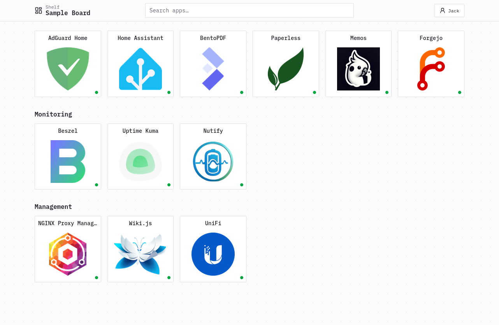

<div align="center">

# Shelf



</div>

Shelf is a small, self-hosted dashboard for one household. It provides a shared library of app links and individually owned boards that are quick to search and easy to edit on any screen — no widgets, YAML, or per-device layouts.

## Features

- A shared app library with a name, optional description, HTTP(S) URL, and an explicitly chosen [Dashboard Icons](https://dashboardicons.com) icon.
- Personal boards with an unguessable public link, owned by one user.
- A responsive tile grid that fills the screen, with app descriptions on hover or focus (and a touch button).
- Board categories to group apps, with manual ordering.
- Fast client-side search across a board.
- App liveness indicators (up, down, not checked).
- Local email/password accounts plus an optional single OIDC provider.
- Import apps from an existing Homarr instance.

## Running with Docker Compose

> **Note:** The container image is not published yet. Until it is, build it yourself from this repository — replace the `image:` line below with `build: .` and run `docker compose up -d --build`.

Create a `compose.yaml`:

```yaml
services:
  shelf:
    image: ghcr.io/JackCuthbert/shelf:latest
    container_name: shelf
    restart: unless-stopped
    ports:
      - "3000:3000"
    environment:
      BETTER_AUTH_URL: https://shelf.example.com
      BETTER_AUTH_SECRET: replace-with-a-long-random-secret
      # ENABLE_SIGNUP: "true"
    volumes:
      - shelf-data:/data

volumes:
  shelf-data:
```

Start it:

```sh
docker compose up -d
```

Open `BETTER_AUTH_URL`; the first visit runs first-account setup. To keep data across upgrades, keep the `/data` volume — it holds the SQLite database (`/data/app.db`) and downloaded icons (`/data/icons`).

## Configuration

| Variable             | Required | Purpose                                                                                                         |
| -------------------- | -------- | --------------------------------------------------------------------------------------------------------------- |
| `BETTER_AUTH_URL`    | Yes      | Shelf's public URL, e.g. `https://shelf.example.com`. Used for auth and OIDC redirects.                         |
| `BETTER_AUTH_SECRET` | Yes      | Long random signing secret. Generate one with `openssl rand -base64 32` and keep it stable.                     |
| `ENABLE_SIGNUP`      | No       | Set to `true` to allow creating additional accounts. Defaults to disabled; the first account is always allowed. |
| `OIDC_ISSUER`        | No       | Generic OIDC issuer URL.                                                                                        |
| `OIDC_CLIENT_ID`     | No       | OIDC client ID.                                                                                                 |
| `OIDC_CLIENT_SECRET` | No       | OIDC client secret.                                                                                             |
| `OIDC_PROVIDER_NAME` | No       | Display name for the provider. Defaults to `OpenID Connect`.                                                    |
| `SHELF_ICON_DIR`     | No       | Icon cache directory. Defaults to `/data/icons`.                                                                |
| `PORT`               | No       | HTTP port. Defaults to `3000`.                                                                                  |

The OIDC variables must all be set together or startup fails. Register `<BETTER_AUTH_URL>/api/auth/callback/oidc` as the provider's redirect URI, and restart the container after changing these settings. Existing users can connect OIDC from **Account settings** after signing in locally.

`BETTER_AUTH_URL` must match the address users actually visit, so terminate TLS in front of the container and point that hostname at port 3000.

## Account maintenance

Reset a password by email; the command prompts for the new password instead of taking it as an argument:

```sh
docker compose exec shelf npm run admin:reset-password -- person@example.com
```
