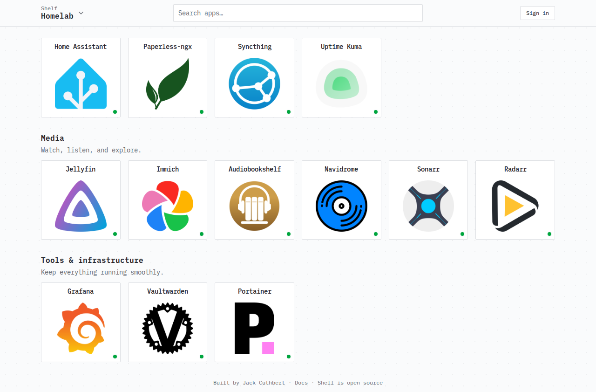
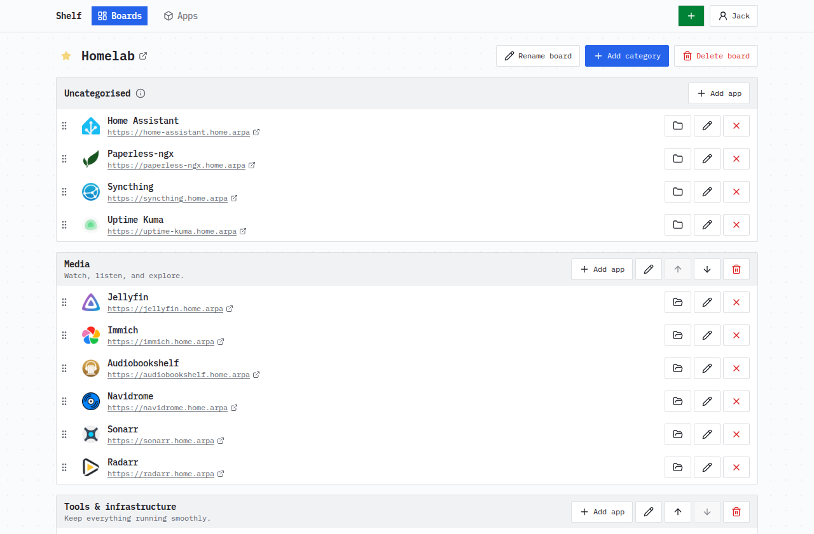
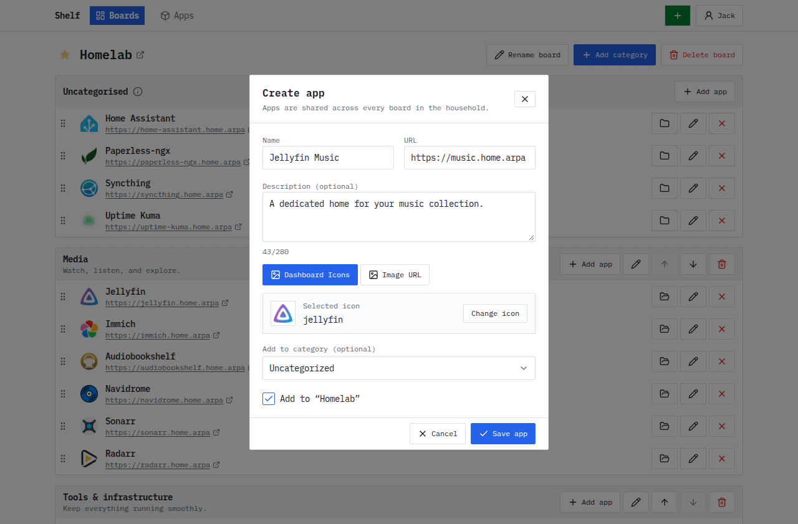
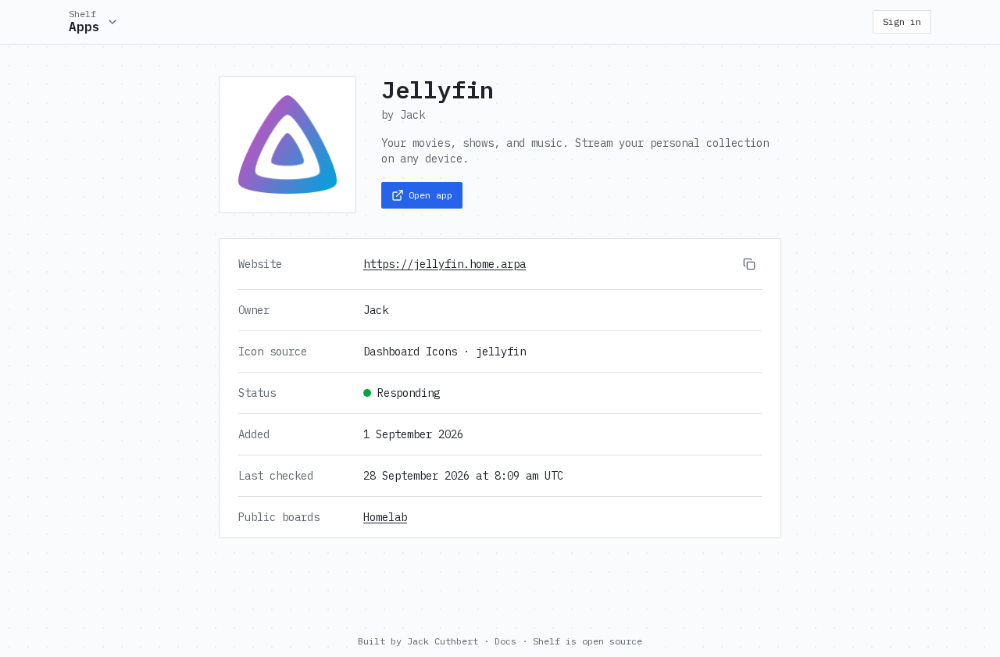

<div align="center">

# Shelf

**A simple front door for the apps you host yourself.**

</div>

[](docs/screenshots/board.png)

Your homelab has enough moving parts. Shelf gives you one place to find
an app, see whether its server replies, and open it.

## What it does

A shared library of app links, arranged into boards of your own.

- **Boards for what belongs together.** Make one for media, one for tools,
  or one for each person in the house. Group apps into categories and put
  them in the order you want. Choose a default board for when you sign in.
- **One app, several boards.** Save a link once and reuse it. Its name,
  address, icon and description stay the same everywhere. Only the person
  who created it can edit or delete it.
- **Find it quickly.** Search the board by app name. Close matches still
  show up when you make a small spelling mistake.
- **Icons you choose.** Pick from [Dashboard Icons](https://dashboardicons.com)
  or supply a PNG URL. Shelf keeps a local copy.
- **A quick check before you click.** A dot shows whether the app's web
  server replied. Shelf checks apps in the background when they are added
  and about once an hour afterward. You can also request a check from an
  app's detail page.
- **Works on a phone.** The grid fits the screen and follows your device's
  light or dark setting. Descriptions appear on hover, keyboard focus, or
  a tap on the info button.
- **Bring your Homarr links.** Review an import, choose icons, and save
  the apps you want to keep.

No widgets, no layout files, no separate arrangement for every device.
Add your links, open a board, get on with what you came to do.

Shelf draws inspiration from [Homarr](https://homarr.dev/) and
[Homepage](https://gethomepage.dev/).

## Screenshots

<table>
  <tr>
    <td align="center"><a href="docs/screenshots/management.png"></a><br>Board management</td>
    <td align="center"><a href="docs/screenshots/create-app.png"></a><br>Create app modal</td>
    <td align="center"><a href="docs/screenshots/app.png"></a><br>Public app detail</td>
  </tr>
</table>

## Who can see what

Every board is public and listed on the homepage. Anyone who can reach
Shelf can view the boards and their app links. A board's URL is a way to
share it, not an access control.

Sign in to create apps and manage your own boards. Apps are shared across
Shelf, but only their owner can change them. Editing an app changes it on
every board that uses it; deleting it removes it from those boards too.
Only you can change your boards, categories and app order.

## Running it

One Docker container, two settings, and a volume for your data.

Create a `compose.yaml`:

```yaml
services:
  shelf:
    image: ghcr.io/jackcuthbert/shelf:latest
    restart: unless-stopped
    ports:
      - "3000:3000"
    environment:
      BETTER_AUTH_URL: https://shelf.example.com
      # openssl rand -base64 32
      BETTER_AUTH_SECRET: replace-with-a-long-random-secret
    volumes:
      - shelf-data:/data

volumes:
  shelf-data:
```

```sh
docker compose up -d
```

Put a reverse proxy in front of it for HTTPS, then open the address you
set in `BETTER_AUTH_URL`. That must be the address people actually visit;
Shelf uses it for authentication and sign-in redirects. Keep the signing
secret private and stable.

The first visit lets you create the first account. Further sign-ups are
disabled by default; add `ENABLE_SIGNUP: "true"` to allow them.

To upgrade, run `docker compose pull && docker compose up -d`.

Keep the `/data` volume when you upgrade, and include it in
your backups. It holds the SQLite database at `/data/app.db` and cached
icons in `/data/icons`. Migrations run automatically when the container
starts.

### OpenID Connect

Local email and password accounts work out of the box. You can also
configure one OpenID Connect provider:

```yaml
OIDC_ISSUER: https://identity.example.com
OIDC_CLIENT_ID: shelf
OIDC_CLIENT_SECRET: replace-with-your-client-secret
# OIDC_PROVIDER_NAME: OpenID Connect
```

Set the issuer, client ID and client secret together. Register
`https://shelf.example.com/api/auth/callback/oidc` as the redirect URI,
using your own Shelf address, and restart the container.

Existing users can connect the provider from **Account settings** after
signing in locally. Creating new accounts through OIDC follows the same
`ENABLE_SIGNUP` setting.

### Other settings

| Variable                            | Default          | What it changes                                 |
| ----------------------------------- | ---------------- | ----------------------------------------------- |
| `OIDC_PROVIDER_NAME`                | `OpenID Connect` | The provider's name on the sign-in page.        |
| `SHELF_ICON_DIR`                    | `/data/icons`    | Where downloaded icons are kept.                |
| `PORT`                              | `3000`           | The container's HTTP port.                      |
| `APP_STATUS_CHECK_INTERVAL_SECONDS` | `3600`           | Automatic app status check interval in seconds. |

Use a whole number of seconds, with a minimum of `60` (one minute). For example, set
`APP_STATUS_CHECK_INTERVAL_SECONDS=1800` to check every 30 minutes. Initial
checks and checks requested manually run immediately.

### Resetting a password

Run this with the account's email address. It prompts for the new password
so you don't have to put it in the command:

```sh
docker compose exec shelf npm run admin:reset-password -- person@example.com
```

## Using the API

Create a named API key in **Account settings** and send it as a bearer
token. For example, to create a board:

```sh
curl -fsS -X POST 'https://shelf.example.com/api/v1/boards' \
  -H 'Authorization: Bearer YOUR_API_KEY' \
  -H 'Content-Type: application/json' \
  -d '{"name":"Assistant"}'
```

The OpenAPI document at `/api/v1/openapi.json` describes the available
operations and their request and response schemas.

## What it does not do

- **Private boards.** All boards and app links are public to anyone who
  can reach Shelf.
- **Application health monitoring.** A green dot means the server replied,
  even if it returned an error page; it cannot tell you whether the app
  itself works correctly.
- **Import a whole Homarr setup.** The import brings over app links.
  Boards, categories and widgets stay behind.

## Docs

Open `/docs` on your Shelf instance for the user guide. It covers boards,
apps, search, live checks and importing from Homarr.

The product specifications live in [spec/](spec/README.md), with hosting
and recovery details in [spec/deployment.md](spec/deployment.md).
